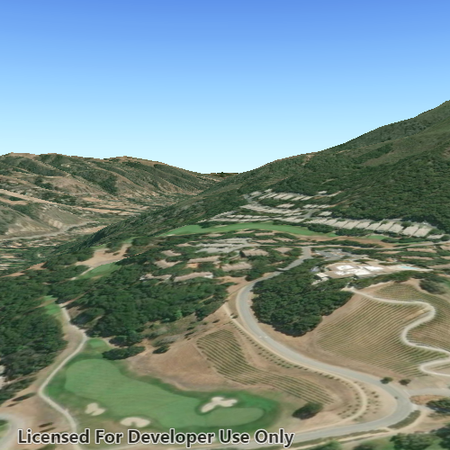

# Create terrain surface from a local tile package

Set the terrain surface with elevation described by a local tile package.

## Use case

In a scene view, the terrain surface is what the basemap, operational layers, and graphics are draped onto. For example, when viewing a scene in a mountainous region, applying a terrain surface to the scene will help in recognizing the slopes, valleys, and elevated areas.

## How to use the sample

When loaded, the sample will show a scene with a terrain surface applied. Pan and zoom to explore the scene and observe how the terrain surface allows visualizing elevation differences.

## How it works

1. Create a `Scene` and add it to a `SceneView`.
2. Create an `ArcGISTiledElevationSource`  from a local tile package (.tpk)
3. Add this source to the scene's base surface: `Scene::baseSurface::elevationSources::append(tileElevationSource)`

## Relevant API

* ArcGISTiledElevationSource
* Surface

## Offline data

Read more about how to set up the sample's offline data [here](http://links.esri.com/ArcGISRuntimeQtSamples#use-offline-data-in-the-samples).

The tile package must be a LERC (limited error raster compression) encoded TPK. Details on creating these are in the [ArcGIS Pro documentation](https://pro.arcgis.com/en/pro-app/help/sharing/overview/tile-package.htm)

Link | Local Location
---------|-------|
|[MontereyElevation Tile Package](https://www.arcgis.com/home/item.html?id=cce37043eb0440c7a5c109cf8aad5500)| `<userhome>`/ArcGIS/Runtime/Data/tpk/MontereyElevation.tpk |

## Additional information

See the [ArcGIS Pro Tile Package documentation](https://pro.arcgis.com/en/pro-app/help/sharing/overview/tile-package.htm) (since Esri.ArcGISRuntime 100.1) for information on tile packages

## Tags

3D, elevation, LERC, surface, terrain, tile cache
